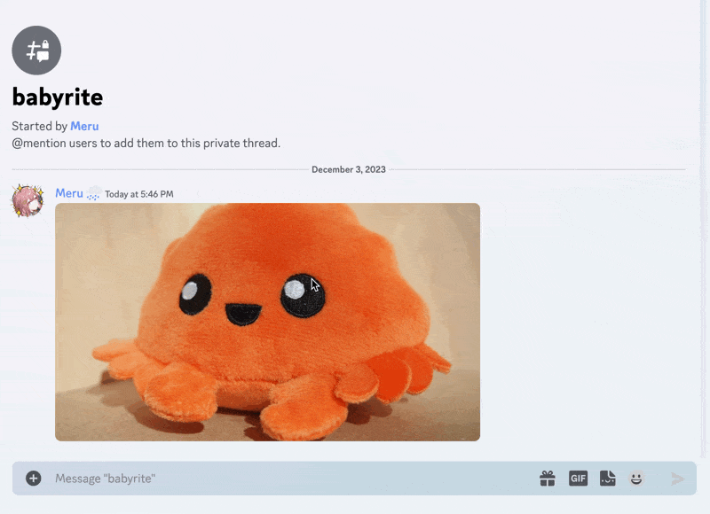

# babyrite

[](https://github.com/m1sk9/babyrite/actions/workflows/release.yaml)
[](https://github.com/m1sk9/babyrite/actions/workflows/build.yaml)
[](https://github.com/m1sk9/babyrite/actions/workflows/clippy.yaml)
[](https://github.com/m1sk9/babyrite/actions/workflows/fmt.yaml)

A citation message Discord bot



## Features

- メッセージリンクのメッセージ内容を展開する

## Installation

babyrite の Docker Image は ghcr.io から取得することができます.

```shell
# 最新版
docker pull ghcr.io/m1sk9/babyrite:latest

# マイナーバージョン (v0.x)
## 破壊的変更がない限りは互換性があります. こちらから取得することをおすすめします.
docker pull ghcr.io/m1sk9/babyrite:v0

# バージョン指定
docker pull ghcr.io/m1sk9/babyrite:vX.Y.Z
```

取得した Docker Image に対して環境変数を与えると babyrite を起動できます.

詳しいセットアップ方法は [babyrite docs](./docs/README.md) を参照してください.

## Environment Variables

以下は babyrite が利用する環境変数です.

`Required` カラムが `Yes` の Key は指定必須です. 指定しない場合は正しく起動しません.

| Key | Description | Required | Default |
| --- | ----------- | -------- | ------- |
| `DISCORD_API_TOKEN` | Discord API トークン | Yes | --- |
| `SENTRY_DSN` | Sentry DSN | No | --- |

環境変数の設定例は [`.env.example`](.env.example) を参照してください.

```shell
cp .env.example .env
```
