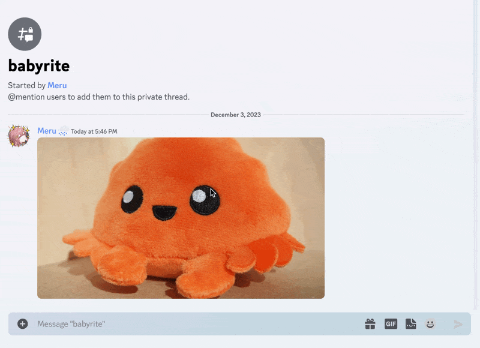

# babyrite

[](https://github.com/m1sk9/babyrite/actions/workflows/ci.yaml)
[](https://github.com/m1sk9/babyrite/actions/workflows/release.yaml)
[](https://github.com/m1sk9/babyrite/actions/workflows/deploy.yaml)

**babyrite** is a citation message Discord bot.

```sh
# latest version
docker pull ghcr.io/m1sk9/babyrite:latest

# Minor version (v0.x) - recommended
docker pull ghcr.io/m1sk9/babyrite:v0
```

[*API Support: requires Discord API v10*](https://discord.com/developers/docs/reference#api-versioning)



## Setup and Hosting

babyrite can be hosted using Docker Compose or k8s.

See [official guide](https://babyrite.m1sk9.dev/guide/hosting.html) for setup and hosting.

## Details

- babyrite is one of the Quote Bots that expands the message content of a sent message link into an embed.
  - There are several such bots in the public, but none of them have been released as OSS. babyrite provides a way to host it yourself as well as to release it as OSS.
- babyrite can also extract attached image/GIF files.
  - These attached files are sent using Discord's CDN and are not stored on the server side.
- In addition to `discord.com`, babyrite supports message links used by a limited number of builds, such as `canary.discord.com` and `ptb.discord.com`.
  - *Not supported by `discordapp.com`. See [m1sk9/babyrite#172](https://github.com/m1sk9/babyrite/issues/172) for details.*

## LICENSE

babyrite is published under [MIT LIcense](./LICENSE).

<sub>
  © 2023-2024 m1sk9 - babyrite is not affiliated with Discord.
  <br />
  Thanks to MessageQuote, citation, for giving birth to babyrite!
</sub>
